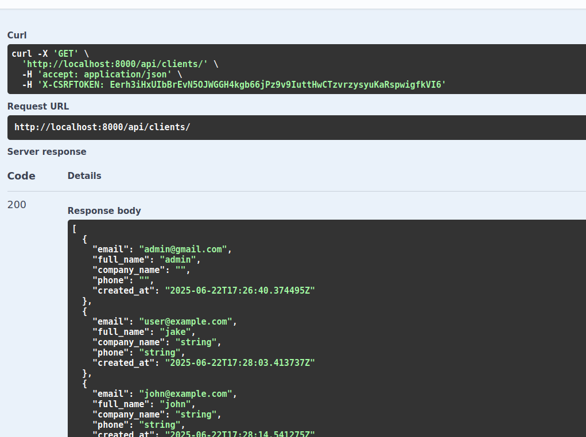

# SaleAnalytic

## Установка и запуск проекта

1. Клонируйте репозиторий:

   ```bash
   git clone <your-repo-url>
   cd saleanalytic
   ```

2. Создайте и активируйте виртуальное окружение:

   ```bash
   python3 -m venv env
   source env/bin/activate  # Linux/macOS
   # .\env\Scripts\activate # Windows
   ```

3. Установите зависимости:

   ```bash
   pip install -r requirements.txt
   ```

4. Выполните миграции для создания базы данных SQLite:

   ```bash
   python manage.py migrate
   ```

5. Запустите сервер разработки:

   ```bash
   python manage.py runserver
   ```

6. Откройте браузер и перейдите по адресу:

   ```
   http://localhost:8000/swagger/
   ```

## Описание API

Проект предоставляет REST API для работы с продуктами, клиентами, заказами и отчетами.

### Основные эндпоинты:

* `api/products/` — список и создание продуктов
* `api/products/<id>/` — детали продукта
* `api/clients/` — список и создание клиентов
* `api/clients/<id>/` — детали клиента
* `api/orders/` — список и создание заказов
* `api/orders/<id>/` — обновление статуса заказа
* `api/reports/sales/` — отчет по продажам
* `api/token/` — получение JWT токена
* `swagger/` — документация API (Swagger UI)

## Примеры запросов



